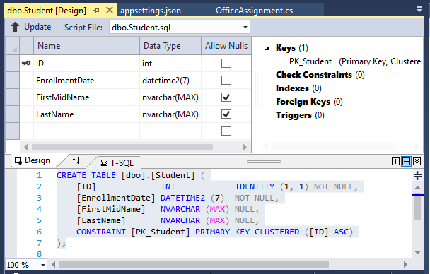
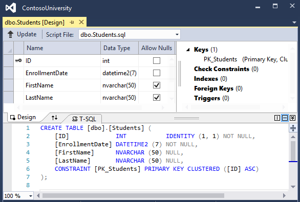
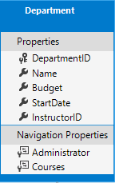

# Creating a complex data model - EF Core with Razor Pages tutorial (5 of 10)

By [Tom Dykstra](https://github.com/tdykstra) and [Rick Anderson](https://twitter.com/RickAndMSFT)

[!INCLUDE[validation](../../includes/RP-EF/intro.md)]

The previous tutorials worked with a basic data model that was composed of three entities. In this tutorial:

* More entities and relationships are added.
* The data model is customized by specifying formatting, validation, and database mapping rules.

The entity classes for the completed data model is shown in the following illustration:


## Customize the data model with attributes

In this section, the data model is customized using attributes.

### The DataType attribute

The student pages currently displays the time of the enrollment date. Typically, date fields show only the date and not the time.

Update *Models/Student.cs* with the following highlighted code:

[!code-csharp[Main](intro/samples/cu/Models/Student.cs?name=snippet_DataType&highlight=3,12-13)]

The [DataType](https://docs.microsoft.com/dotnet/api/system.componentmodel.dataannotations.datatypeattribute?view=netframework-4.7.1) attribute specifies a data type that is more specific than the database intrinsic type. In this case only the date should be displayed, not the date and time. The [DataType Enumeration](https://docs.microsoft.com/dotnet/api/system.componentmodel.dataannotations.datatype?view=netframework-4.7.1) provides for many data types, such as Date, Time, PhoneNumber, Currency, EmailAddress, etc. The `DataType` attribute can also enable the app to automatically provide type-specific features. For example:

* The `mailto:` link is automatically created for `DataType.EmailAddress`.
* The date selector is provided for `DataType.Date` in most browsers.

The `DataType` attribute emits HTML 5 `data-` (pronounced data dash) attributes that HTML 5 browsers consume. The `DataType` attributes do not provide validation.

`DataType.Date` does not specify the format of the date that is displayed. By default, the date field is displayed according to the default formats based on the server's [CultureInfo](https://docs.microsoft.com/aspnet/core/fundamentals/localization#provide-localized-resources-for-the-languages-and-cultures-you-support).

The `DisplayFormat` attribute is used to explicitly specify the date format:

```csharp
[DisplayFormat(DataFormatString = "{0:yyyy-MM-dd}", ApplyFormatInEditMode = true)]
```

The `ApplyFormatInEditMode` setting specifies that the formatting should also be applied to the edit UI. Some fields should not use `ApplyFormatInEditMode`. For example, the currency symbol should generally not be displayed in an edit text box.

The `DisplayFormat` attribute can be used by itself. It's generally a good idea to use the `DataType` attribute with the `DisplayFormat` attribute. The `DataType` attribute conveys the semantics of the data as opposed to how to render it on a screen. The `DataType` attribute provides the following benefits that are not available in `DisplayFormat`:

* The browser can enable HTML5 features. For example, show a calendar control, the locale-appropriate currency symbol, email links, client-side input validation, etc.
* By default, the browser renders data using the correct format based on the locale.

For more information, see the [\<input> Tag Helper documentation](xref:mvc/views/working-with-forms#the-input-tag-helper).

Run the app. Navigate to the Students Index page. Times are no longer displayed. Every view that uses the `Student` model displays the date without time.


### The StringLength attribute

Data validation rules and validation error messages can be specified with attributes. The [StringLength](https://docs.microsoft.com/dotnet/api/system.componentmodel.dataannotations.stringlengthattribute?view=netframework-4.7.1) attribute specifies the minimum and maximum length of characters that are allowed in a data field. The `StringLength` attribute
also provides client-side and server-side validation. The minimum value has no impact on the database schema.

Update the `Student` model with the following code:

[!code-csharp[Main](intro/samples/cu/Models/Student.cs?name=snippet_StringLength&highlight=10,12)]

The preceding code limits names to no more than 50 characters. The `StringLength` attribute doesn't prevent a user from entering white space for a name. The [RegularExpression](https://docs.microsoft.com/dotnet/api/system.componentmodel.dataannotations.regularexpressionattribute?view=netframework-4.7.1) attribute is used to apply restrictions to the input. For example, the following code requires the first character to be upper case and the remaining characters to be alphabetical:

```csharp
[RegularExpression(@"^[A-Z]+[a-zA-Z''-'\s]*$")]
```

Run the app:

* Navigate to the Students page.
* Select **Create New**, and enter a name longer than 50 characters.
* Select **Create**, client-side validation shows an error message.


In **SQL Server Object Explorer** (SSOX), open the Student table designer by double-clicking the **Student** table.



The preceding image shows the schema for the `Student` table.

### The Column attribute

Attributes can control how classes and properties are mapped to the database. In this section, the `Column` attribute is used to map the name of the `FirstMidName` property to "FirstName" in the DB.

When the DB is created, property names on the model are used for column names (except when the `Column` attribute is used).

The `Student` model uses `FirstMidName` for the first-name field because the field might also contain a middle name.

Update the *Student.cs* file with the following highlighted code:

[!code-csharp[Main](intro/samples/cu/Models/Student.cs?name=snippet_Column&highlight=4,14)]

With the preceding change, `Student.FirstMidName` in the app maps to the `FirstName` column of the `Student` table.

The addition of the `Column` attribute changes the model backing the `SchoolContext`. The model backing the `SchoolContext` no longer matches the database. If the app is run before applying migrations, the following exception is generated:

```SQL
SqlException: Invalid column name 'FirstName'.
```
To update the DB:

* Build the project.
* Open a command window in the project folder. Enter the following commands to create a new migration and update the DB:

	```console
	dotnet ef migrations add ColumnFirstName
	dotnet ef database update
	```

The `dotnet ef migrations add ColumnFirstName` command generates the following warning message:

```text
An operation was scaffolded that may result in the loss of data.
Please review the migration for accuracy.
```

The warning is generated because the name fields are now limited to 50 characters. If a name in the DB had more than 50 characters, the 51 to last character would be lost.

* Test the app.

Open the Student table in SSOX:



Before migration was applied, the name columns were of type [nvarchar(MAX)](https://docs.microsoft.com/sql/t-sql/data-types/nchar-and-nvarchar-transact-sql). The name columns are now `nvarchar(50)`. The column name has changed from `FirstMidName` to `FirstName`.

> [!Note]
> In the following section, building the app at some stages generates compiler errors. The instructions specify when to build the app.

## Student entity update


Update *Models/Student.cs* with the following code:

[!code-csharp[Main](intro/samples/cu/Models/Student.cs?name=snippet_BeforeInheritance&highlight=11,13,15,18,22,24-31)]

### The Required attribute

The `Required` attribute makes the name properties required fields. The `Required` attribute is not needed for non-nullable types such as value types (`DateTime`, `int`, `double`, etc.). Types that can't be null are automatically treated as required fields.

The `Required` attribute could be replaced with a minimum length parameter in the `StringLength` attribute:

```csharp
[Display(Name = "Last Name")]
[StringLength(50, MinimumLength=1)]
public string LastName { get; set; }
```

### The Display attribute

The `Display` attribute specifies that the caption for the text boxes should be "First Name", "Last Name", "Full Name", and "Enrollment Date." The default captions had no space dividing the words, for example "Lastname."

### The FullName calculated property

`FullName` is a calculated property that returns a value that's created by concatenating two other properties. `FullName` cannot be set, it has only a get accessor. No `FullName` column is created in the database.

## Create the Instructor Entity


Create *Models/Instructor.cs* with the following code:

[!code-csharp[Main](intro/samples/cu/Models/Instructor.cs?name=snippet_BeforeInheritance)]

Notice that several properties are the same in the `Student` and `Instructor` entities. In the Implementing Inheritance tutorial later in this series, this code is refactored
to eliminate the redundancy.

Multiple attributes can be on one line. The `HireDate` attributes could be written as follows:

```csharp
[DataType(DataType.Date),Display(Name = "Hire Date"),DisplayFormat(DataFormatString = "{0:yyyy-MM-dd}", ApplyFormatInEditMode = true)]
```

### The CourseAssignments and OfficeAssignment navigation properties

The `CourseAssignments` and `OfficeAssignment` properties are navigation properties.

An instructor can teach any number of courses, so `CourseAssignments` is defined as a collection.

```csharp
public ICollection<CourseAssignment> CourseAssignments { get; set; }
```

If a navigation property holds multiple entities:

* It must be a list type where the entries can be added, deleted, and updated.

Navigation property types include:

* `ICollection<T>`
*  `List<T>`
*  `HashSet<T>`

If `ICollection<T>` is specified, EF creates a `HashSet<T>` collection by default.

The `CourseAssignment` entity is explained in the section on many-to-many relationships.

Contoso University business rules state that an instructor can have at most one office. The `OfficeAssignment` property holds a single `OfficeAssignment` entity. `OfficeAssignment` is null if no office is assigned.

```csharp
public OfficeAssignment OfficeAssignment { get; set; }
```

## Create the OfficeAssignment entity


Create *Models/OfficeAssignment.cs* with the following code:

[!code-csharp[Main](intro/samples/cu/Models/OfficeAssignment.cs)]

### The Key attribute

The `[Key]` attribute is used to identify a property as the primary key (PK) when the property name is something other than classnameID or ID.

There's a one-to-zero-or-one relationship between the `Instructor` and `OfficeAssignment` entities. An office assignment only exists in relation to the instructor it's assigned to. The `OfficeAssignment` PK is also its foreign key (FK) to the `Instructor` entity. EF can't automatically recognize `InstructorID` as the PK of `OfficeAssignment` because:

* `InstructorID` doesn't follow the ID or classnameID naming convention.

Therefore, the `Key` attribute is used to identify `InstructorID` as the PK:

```csharp
[Key]
public int InstructorID { get; set; }
```

By default, EF treats the key as non-database-generated because the column is for an identifying relationship.

### The Instructor navigation property

The `OfficeAssignment` navigation property for the `Instructor` entity is nullable because:

* Reference types (such as classes are nullable).
* An instructor might not have an office assignment.


The `OfficeAssignment` entity has a non-nullable `Instructor` navigation property because:

* `InstructorID` is non-nullable.
* An office assignment can't exist without an instructor.

When an `Instructor` entity has a related `OfficeAssignment` entity, each entity has a reference to the other one in its navigation property.

The `[Required]` attribute could be applied to the `Instructor` navigation property:

```csharp
[Required]
public Instructor Instructor { get; set; }
```

The preceding code specifies that there must be a related instructor. The preceding code is unnecessary because the `InstructorID` foreign key (which is also the PK) is non-nullable.

## Modify the Course Entity


Update *Models/Course.cs* with the following code:

[!code-csharp[Main](intro/samples/cu/Models/Course.cs?name=snippet_Final&highlight=2,10,13,16,19,21,23)]

The `Course` entity has a foreign key (FK) property `DepartmentID`. `DepartmentID` points to the related `Department` entity. The `Course` entity has a `Department` navigation property.

EF doesn't require a FK property for a data model when the model has a navigation property for a related entity.

EF automatically creates FKs in the database wherever they are needed. EF creates [shadow properties](https://docs.microsoft.com/ef/core/modeling/shadow-properties) for automatically created FKs. Having the FK in the data model can make updates simpler and more efficient. For example, consider a model where the FK property `DepartmentID` is *not* included. When a course entity is fetched to edit:

* The `Department` entity is null if it's not explicitly loaded.
* To update the course entity, the `Department` entity must first be fetched.

When the FK property `DepartmentID` is included in the data model, there is no need to
fetch the `Department` entity before an update.

### The DatabaseGenerated attribute

The `[DatabaseGenerated(DatabaseGeneratedOption.None)]` attribute specifies that the PK is provided by the application rather than generated by the database.

```csharp
[DatabaseGenerated(DatabaseGeneratedOption.None)]
[Display(Name = "Number")]
public int CourseID { get; set; }
```

By default, EF assumes that PK values are generated by the DB. DB generated PK values is generally the best approach. For `Course` entities, the user specifies the PK. For example, a course number such as a 1000 series for the math department, a 2000 series for the English department.

The `DatabaseGenerated` attribute can also be used to generate default values. For example, the DB can automatically generate a date field to record the date a row was created or updated. For more information, see [Generated Properties](https://docs.microsoft.com/ef/core/modeling/generated-properties).

### Foreign key and navigation properties

The foreign key (FK) properties and navigation properties in the `Course` entity reflect the following relationships:

A course is assigned to one department, so there's a `DepartmentID` FK and a `Department` navigation property.

```csharp
public int DepartmentID { get; set; }
public Department Department { get; set; }
```

A course can have any number of students enrolled in it, so the `Enrollments` navigation property is a collection:

```csharp
public ICollection<Enrollment> Enrollments { get; set; }
```

A course may be taught by multiple instructors, so the `CourseAssignments` navigation property is a collection:

```csharp
public ICollection<CourseAssignment> CourseAssignments { get; set; }
```

`CourseAssignment` is explained [later](#many-to-many-relationships).

## Create the Department entity



Create *Models/Department.cs* with the following code:

[!code-csharp[Main](intro/samples/cu/Models/Department.cs?name=snippet_Begin)]

### The Column attribute

Previously the `Column` attribute was used to change column name mapping. In the code for the `Department` entity, the `Column` attribute is used to change SQL data type mapping. The `Budget` column is defined using the SQL Server money type in the DB:

```csharp
[Column(TypeName="money")]
public decimal Budget { get; set; }
```

Column mapping is generally not required. EF generally chooses the appropriate SQL Server data type based on the CLR type for the property. The CLR `decimal` type maps to a SQL Server `decimal` type. `Budget` is for currency, and the money data type is more appropriate for currency.

### Foreign key and navigation properties

The FK and navigation properties reflect the following relationships:

* A department may or may not have an administrator.
* An administrator is always an instructor. Therefore the `InstructorID` property is included as the FK to the `Instructor` entity.

The navigation property is named `Administrator` but holds an `Instructor` entity:

```csharp
public int? InstructorID { get; set; }
public Instructor Administrator { get; set; }
```

The question mark (?) in the preceding code specifies the property is nullable.

A department may have many courses, so there's a Courses navigation property:

```csharp
public ICollection<Course> Courses { get; set; }
```

Note: By convention, EF enables cascade delete for non-nullable FKs and for many-to-many relationships. Cascading delete can result in circular cascade delete rules. Circular cascade delete rules causes an exception when a migration is added.

For example, if the `Department.InstructorID` property was not defined as nullable:

* EF configures a cascade delete rule to delete the instructor when the department is deleted.
* Deleting the instructor when the department is deleted is not the intended behavior.

If business rules required the `InstructorID` property be non-nullable, use the following fluent API statement:

 ```csharp
 modelBuilder.Entity<Department>()
    .HasOne(d => d.Administrator)
    .WithMany()
    .OnDelete(DeleteBehavior.Restrict)
 ```

The preceding code disables cascade delete on the department-instructor relationship.

## Update the Enrollment entity

An enrollment record is for a one course taken by one student.


Update *Models/Enrollment.cs* with the following code:

[!code-csharp[Main](intro/samples/cu/Models/Enrollment.cs?name=snippet_Final&highlight=1-2,16)]

### Foreign key and navigation properties

The FK properties and navigation properties reflect the following relationships:

An enrollment record is for one course, so there's a `CourseID` FK property and a `Course` navigation property:

```csharp
public int CourseID { get; set; }
public Course Course { get; set; }
```

An enrollment record is for one student, so there's a `StudentID` FK property and a `Student` navigation property:

```csharp
public int StudentID { get; set; }
public Student Student { get; set; }
```

## Many-to-Many Relationships

There's a many-to-many relationship between the `Student` and `Course` entities. The `Enrollment` entity functions as a many-to-many join table *with payload* in the database. "With payload" means that the `Enrollment` table contains additional data besides FKs for the joined tables (in this case, the PK and `Grade`).

The following illustration shows what these relationships look like in an entity diagram. (This diagram was generated using EF Power Tools for EF 6.x. Creating the diagram isn't part of the tutorial.)


Each relationship line has a 1 at one end and an asterisk (*) at the other, indicating a one-to-many relationship.

If the `Enrollment` table didn't include grade information, it would only need to contain the two FKs (`CourseID` and `StudentID`). A many-to-many join table without payload is sometimes called a pure join table (PJT).

The `Instructor` and `Course` entities have a many-to-many relationship using a pure join table.

Note: EF 6.x supports implicit join tables for many-to-many relationships, but EF Core does not. For more information, see [Many-to-many relationships in EF Core 2.0](https://blog.oneunicorn.com/2017/09/25/many-to-many-relationships-in-ef-core-2-0-part-1-the-basics/).

## The CourseAssignment entity


Create *Models/CourseAssignment.cs* with the following code:

[!code-csharp[Main](intro/samples/cu/Models/CourseAssignment.cs)]

### Instructor-to-Courses


The Instructor-to-Courses many-to-many relationship:

* Requires a join table that must be represented by an entity set.
* Is a pure join table (table without payload).

It's common to name a join entity `EntityName1EntityName2`. For example, the Instructor-to-Courses join table using this pattern is `CourseInstructor`. However, we recommend using a name that describes the relationship.

Data models start out simple and grow. No-payload joins (PJTs) frequently evolve to include payload. By starting with a descriptive entity name, the name doesn't need to change when the join table changes. Ideally, the join entity would have its own natural (possibly single word) name in the business domain. For example, Books and Customers could be linked with a join entity called Ratings. For the Instructor-to-Courses many-to-many relationship, `CourseAssignment` is preferred over `CourseInstructor`.

### Composite key

FKs are not nullable. The two FKs in `CourseAssignment` (`InstructorID` and `CourseID`) together uniquely identify each row of the `CourseAssignment` table. `CourseAssignment` doesn't require a dedicated PK. The `InstructorID` and `CourseID` properties function as a composite PK. The only way to specify composite PKs to EF is with the *fluent API*. The next section shows how to configure the composite PK.

The composite key ensures:

* Multiple rows are allowed for one course.
* Multiple rows are allowed for one instructor.
* Multiple rows for the same instructor and course is not allowed.

The `Enrollment` join entity defines its own PK, so duplicates of this sort are possible. To prevent such duplicates:

* Add a unique index on the FK fields, or
* Configure `Enrollment` with a primary composite key similar to `CourseAssignment`. For more information, see [Indexes](https://docs.microsoft.com/ef/core/modeling/indexes).

## Update the DB context

Add the following highlighted code to *Data/SchoolContext.cs*:

[!code-csharp[Main](intro/samples/cu/Data/SchoolContext.cs?name=snippet_BeforeInheritance&highlight=15-18,25-31)]

The preceding code adds the new entities and configures the `CourseAssignment` entity's composite PK.

## Fluent API alternative to attributes

The `OnModelCreating` method in the preceding code uses the *fluent API* to configure EF behavior. The API is called "fluent" because it's often used by stringing a series of method calls together into a single statement. The [following code](https://docs.microsoft.com/ef/core/modeling/#methods-of-configuration) is an example of the fluent API:

```csharp
protected override void OnModelCreating(ModelBuilder modelBuilder)
{
    modelBuilder.Entity<Blog>()
        .Property(b => b.Url)
        .IsRequired();
}
```

In this tutorial, the fluent API is used only for DB mapping that can't be done with attributes. However, the fluent API can specify most of the formatting, validation, and mapping rules that can be done with attributes.

Some attributes such as `MinimumLength` can't be applied with the fluent API. `MinimumLength` doesn't change the schema, it only applies a minimum length validation rule.

Some developers prefer to use the fluent API exclusively so that they can keep their entity classes "clean." Attributes and the fluent API can be mixed. There are some configurations that can only be done with the fluent API (specifying a composite PK). There are some configurations that can only be done with attributes (`MinimumLength`). The recommended practice for using fluent API or attributes:

* Choose one of these two approaches.
* Use the chosen approach consistently as much as possible.

For more information about attributes vs. fluent API, see [Methods of configuration](https://docs.microsoft.com/ef/core/modeling/#methods-of-configuration).

## Entity Diagram Showing Relationships

The following illustration shows the diagram that EF Power Tools create for the completed School model.


The preceding diagram shows:

* Several one-to-many relationship lines (1 to \*).
* The one-to-zero-or-one relationship line (1 to 0..1) between the `Instructor` and `OfficeAssignment` entities.
* The zero-or-one-to-many relationship line (0..1 to *) between the `Instructor` and `Department` entities.

## Seed the DB with Test Data

Update the code in *Data/DbInitializer.cs*:

[!code-csharp[Main](intro/samples/cu/Data/DbInitializer.cs?name=snippet_Final)]

The preceding code provides seed data for the new entities. Most of this code creates new entity objects and loads sample data. The sample data is used for testing. The preceding code creates the following many-to-many relationships:

* `Enrollments`
* `CourseAssignment`

## Add a migration

Build the project. Open a command window in the project folder and enter the following command:

```console
dotnet ef migrations add ComplexDataModel
```

The preceding command displays a warning about possible data loss.

```text
An operation was scaffolded that may result in the loss of data.
Please review the migration for accuracy.
Done. To undo this action, use 'ef migrations remove'
```

If the `database update` command is run, the following error is produced:

```text
The ALTER TABLE statement conflicted with the FOREIGN KEY constraint "FK_dbo.Course_dbo.Department_DepartmentID". The conflict occurred in
database "ContosoUniversity", table "dbo.Department", column 'DepartmentID'.
```

When migrations are run with existing data, there may be FK constraints that are not satisfied with the exiting data. For this tutorial, a new DB is created, so there are no FK constraint violations. See
[Fixing foreign key constraints with legacy data](#fk) for instructions on how to fix the FK violations on the current DB.

## Change the connection string and update the DB

The code in the updated `DbInitializer` adds seed data for the new entities. To force EF to create a new empty DB:

* Change the DB connection string name in *appsettings.json* to ContosoUniversity3. The new name must be a name that hasn't been used on the computer.

	```json
	{
	  "ConnectionStrings": {
		"DefaultConnection": "Server=(localdb)\\mssqllocaldb;Database=ContosoUniversity3;Trusted_Connection=True;MultipleActiveResultSets=true"
	  },
	```

* Alternatively, delete the DB using:

	* **SQL Server Object Explorer** (SSOX).
	* The `database drop` CLI command:

   ```console
   dotnet ef database drop
   ```

Run `database update` in the command window:

```console
dotnet ef database update
```

The preceding command runs all the migrations.

Run the app. Running the app runs the `DbInitializer.Initialize` method. The `DbInitializer.Initialize` populates the new DB.

Open the DB in SSOX:

* Expand the **Tables** node. The created tables are displayed.
* If SSOX was opened previously, click the **Refresh** button.


Examine the **CourseAssignment** table:

* Right-click the **CourseAssignment** table and select **View Data**.
* Verify the **CourseAssignment** table contains data.


<a name="fk"></a>

## Fixing foreign key constraints with legacy data

This section is optional.

When migrations are run with existing data, there may be FK constraints that are not satisfied with the exiting data. With production data, steps must be taken to migrate the existing data. This section provides an example of fixing FK constraint violations. Don't make these code changes without a backup. Don't make these code changes if you completed the previous section and updated the database.

The *{timestamp}_ComplexDataModel.cs* file contains the following code:

[!code-csharp[Main](intro/samples/cu/Migrations/20171027005808_ComplexDataModel.cs?name=snippet_DepartmentID)]

The preceding code adds a non-nullable `DepartmentID` FK to the `Course` table. The DB from the previous tutorial contains rows in `Course`, so that table cannot be updated by migrations.

To make the `ComplexDataModel` migration work with existing data:

* Change the code to give the new column (`DepartmentID`) a default value.
* Create a fake department named "Temp" to act as the default department.

### Fix the foreign key constraints

Update the `ComplexDataModel` classes `Up` method:

* Open the *{timestamp}_ComplexDataModel.cs* file.
* Comment out the line of code that adds the `DepartmentID` column to the `Course` table.

[!code-csharp[Main](intro/samples/cu/Migrations/20171027005808_ComplexDataModel.cs?name=snippet_CommentOut&highlight=9-13)]

Add the following highlighted code. The new code goes after the `.CreateTable( name: "Department"` block:
 [!code-csharp[Main](intro/samples/cu/Migrations/20171027005808_ComplexDataModel.cs?name=snippet_CreateDefaultValue&highlight=22-32)]

With the preceding changes, existing `Course` rows will be related to the "Temp" department after the `ComplexDataModel` `Up` method runs.

A production app would:

* Include code or scripts to add `Department` rows and related `Course` rows to the new `Department` rows.
* Would not use the "Temp" department or the default value for `Course.DepartmentID `.

The next tutorial covers related data.

>[!div class="step-by-step"]
[Previous](xref:data/ef-rp/migrations)

<!--
[Next](read-related-data.md)

-->