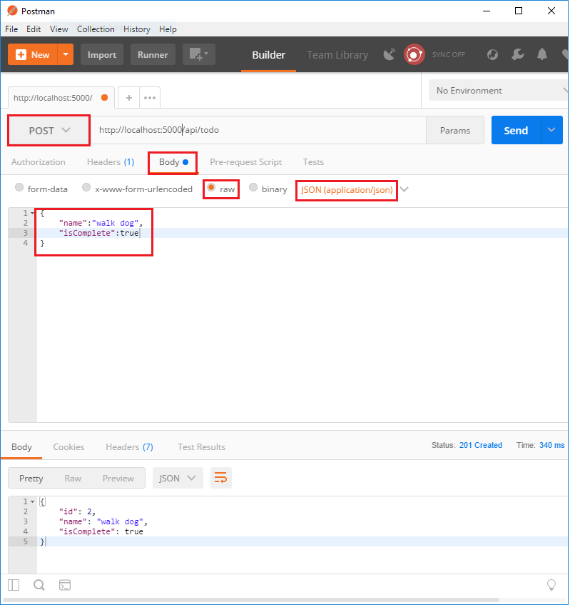

## Implement the other CRUD operations

In the following sections, `Create`, `Update`, and `Delete` methods are added to the controller.

### Create

[!code-csharp[Main](../../tutorials/first-web-api/sample/TodoApi/Controllers/TodoController.cs?name=snippet_Create)]

The preceding code is an HTTP POST method, indicated by the [`[HttpPost]`](/aspnet/core/api/microsoft.aspnetcore.mvc.httppostattribute) attribute. The [`[FromBody]`](/aspnet/core/api/microsoft.aspnetcore.mvc.frombodyattribute) attribute tells MVC to get the value of the to-do item from the body of the HTTP request.

The `CreatedAtRoute` method:

* Returns a 201 response. HTTP 201 is the standard response for an HTTP POST method that creates a new resource on the server.
* Adds a Location header to the response. The Location header specifies the URI of the newly created to-do item. See [10.2.2 201 Created](http://www.w3.org/Protocols/rfc2616/rfc2616-sec10.html).
* Uses the "GetTodo" named route paramater to create the URL. "GetTodo" is defined in `GetById`:

[!code-csharp[Main](../../tutorials/first-web-api/sample/TodoApi/Controllers/TodoController.cs?name=snippet_GetByID&highlight=1-2)]

### Use Postman to send a Create request



* Set the HTTP method to `POST`
* Select the **Body** radio button
* Select the **raw** radio button
* Set the type to JSON
* In the key-value editor, enter a Todo item such as

```json
{
	"name":"walk dog",
	"isComplete":true
}
```

* Select **Send**

* Select the Headers tab in the lower pane and copy the **Location** header:


The Location header URI can be used to access the new item.

### Update

Add the following code:

[!code-csharp[Main](../../tutorials/first-web-api/sample/TodoApi/Controllers/TodoController.cs?name=snippet_Update)]

`Update` is similar to `Create`, but uses HTTP PUT. The response is [204 (No Content)](http://www.w3.org/Protocols/rfc2616/rfc2616-sec9.html). According to the HTTP spec, a PUT request requires the client to send the entire updated entity, not just the deltas. To support partial updates, use HTTP PATCH.


### Delete

Add the following code:

[!code-csharp[Main](../../tutorials/first-web-api/sample/TodoApi/Controllers/TodoController.cs?name=snippet_Delete)]

The `Delete` response is [204 (No Content)](http://www.w3.org/Protocols/rfc2616/rfc2616-sec9.html).


